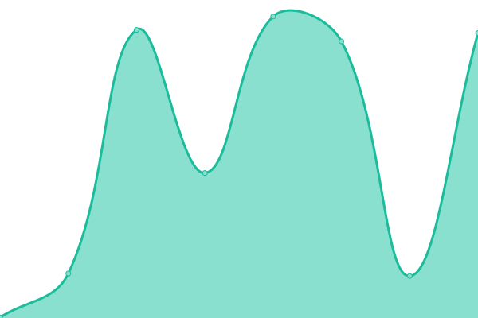

# [📈 Live Status](https://demo.upptime.js.org): <!--live status--> **🟧 Partial outage**

This repository contains the open-source uptime monitor and status page for [Upptime](https://upptime.js.org), powered by [Upptime](https://github.com/upptime/upptime).

With [Upptime](https://upptime.js.org), you can get your own unlimited and free uptime monitor and status page, powered entirely by a GitHub repository. We use [Issues](https://github.com/upptime/upptime/issues) as incident reports, [Actions](https://github.com/deeper-chain/deeper-upptime/actions) as uptime monitors, and [Pages](https://demo.upptime.js.org) for the status page.

<!--start: status pages-->
<!-- This summary is generated by Upptime (https://github.com/upptime/upptime) -->
<!-- Do not edit this manually, your changes will be overwritten -->
<!-- prettier-ignore -->
| URL | Status | History | Response Time | Uptime |
| --- | ------ | ------- | ------------- | ------ |
|  [Deeper Network](https://www.deeper.network) | 🟩 Up | [deeper-network.yml](https://github.com/deeper-chain/deeper-upptime/commits/HEAD/history/deeper-network.yml) | 

 1003ms
     
 | 

<a href="https://status.deeper.network/history/deeper-network">100.00%</a>
    

|  [Deeper Mainnet](https://mainnet.deeper.network/health) | 🟩 Up | [deeper-mainnet.yml](https://github.com/deeper-chain/deeper-upptime/commits/HEAD/history/deeper-mainnet.yml) | 

 151ms
     
 | 

<a href="https://status.deeper.network/history/deeper-mainnet">100.00%</a>
    

|  [DeeperScan](https://www.deeperscan.io/deeper) | 🟩 Up | [deeper-scan.yml](https://github.com/deeper-chain/deeper-upptime/commits/HEAD/history/deeper-scan.yml) | 

 228ms
     
 | 

<a href="https://status.deeper.network/history/deeper-scan">97.73%</a>
    

|  [EVM](https://evm.deeper.network/) | 🟥 Down | [evm.yml](https://github.com/deeper-chain/deeper-upptime/commits/HEAD/history/evm.yml) | 

 776ms
     
 | 

<a href="https://status.deeper.network/history/evm">92.43%</a>
    

|  [Deeper Chain Explorer](https://apps.deeper.network) | 🟩 Up | [deeper-chain-explorer.yml](https://github.com/deeper-chain/deeper-upptime/commits/HEAD/history/deeper-chain-explorer.yml) | 

 818ms
     
 | 

<a href="https://status.deeper.network/history/deeper-chain-explorer">100.00%</a>
    

|  [Device BSC](https://device-bsc.deeper.network/login) | 🟩 Up | [device-bsc.yml](https://github.com/deeper-chain/deeper-upptime/commits/HEAD/history/device-bsc.yml) | 

 816ms
     
 | 

<a href="https://status.deeper.network/history/device-bsc">100.00%</a>
    

|  [Deeper Miner](https://miner.deeper.network/login) | 🟩 Up | [deeper-miner.yml](https://github.com/deeper-chain/deeper-upptime/commits/HEAD/history/deeper-miner.yml) | 

 810ms
     
 | 

<a href="https://status.deeper.network/history/deeper-miner">100.00%</a>
    

|  [Deeper Miner API](https://api-miner.deeper.network) | 🟩 Up | [deeper-miner-api.yml](https://github.com/deeper-chain/deeper-upptime/commits/HEAD/history/deeper-miner-api.yml) | 

 773ms
     
 | 

<a href="https://status.deeper.network/history/deeper-miner-api">100.00%</a>
    

<!--end: status pages-->

[**Visit our status website →**](https://demo.upptime.js.org)

## 📄 License

- Powered by: [Upptime](https://github.com/upptime/upptime)
- Code: [MIT](./LICENSE) © [Upptime](https://upptime.js.org)
- Data in the `./history` directory: [Open Database License](https://opendatacommons.org/licenses/odbl/1-0/)
